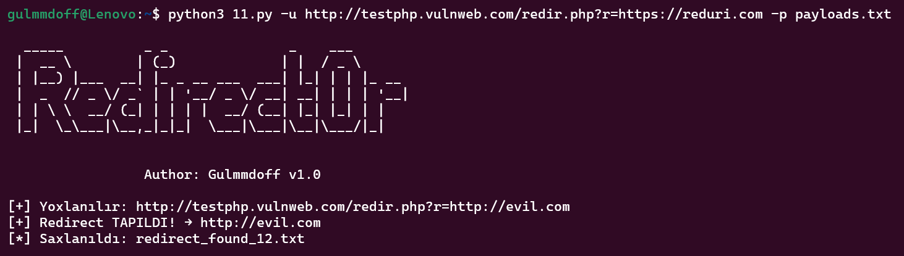

# Redirect0r 🚨

**Redirect0r** is a Python-based Open Redirect vulnerability scanner.  
It helps security researchers find open redirect issues by injecting payloads into URL parameters.


## ✨ Features
```
🔍 Automatic detection of redirect parameters
🚀 Custom payload injection
🧠 Rate limiting
📁 Auto-save results per match
✅ Supports single URL or list of URLs
```


 ## Requirements
 Python 3.7+

 
 ## Install 
 ```
 git clone https://github.com/gulmmdoff/Redirect0r.git 
 cd Redirect0r 
 pip install -r requirements.txt
```


 ## Using
 ```
 python redirect0r.py -u "https://example.com?redirect=https://test.com" -p payloads.txt
```

